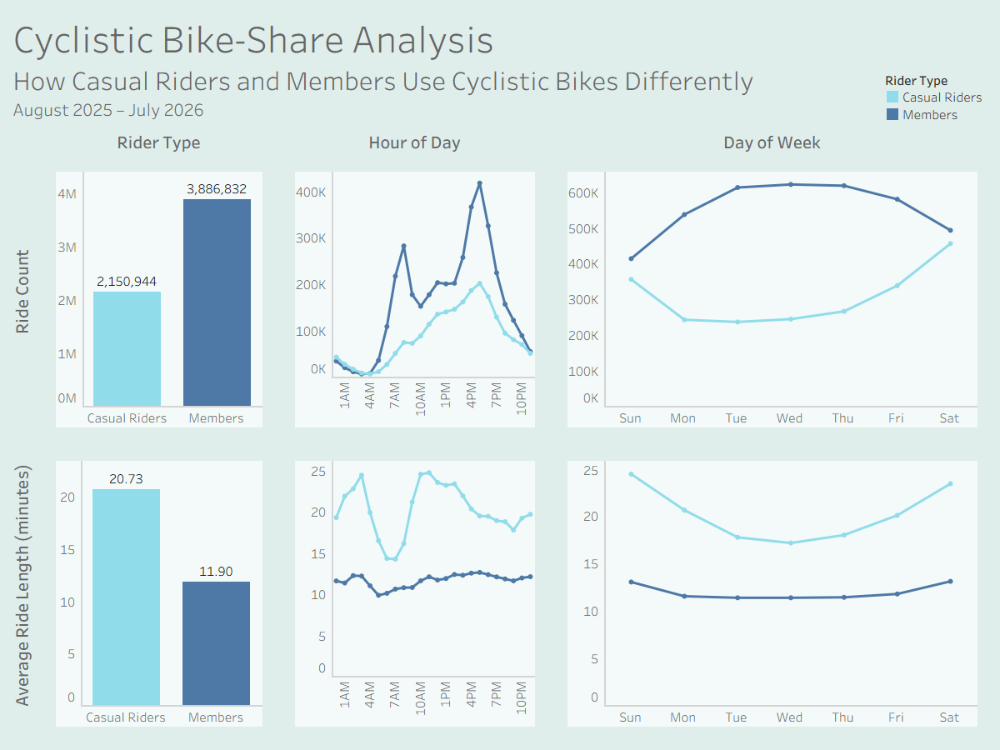

# Cyclistic Bike-Share Analysis
### How Casual Riders and Members use Cyclistic bikes differently
**August 2025 – July 2026**

> **Project Context:** This project is a capstone completed as part of the Google Data Analytics Professional Certificate. While Cyclistic is a fictional Chicago bike-share company, the analysis uses real trip data provided by Lyft Bikes and Scooters, LLC.

---

# 1. Summary & Business Task

Cyclistic wants to increase memberships by converting existing casual riders into members. Understanding how casual riders and members use Cyclistic bikes differently could help reach this goal.

**Objective:** Analyze 12 months of bike-share data to identify differences in ride usage patterns between casual riders and members, developing recommendations based on those findings.

---

# 2. Data Sources & Tools

* **Dataset:** 12 months of Divvy/Cyclistic trip data (August 2025 – July 2026) made publicly available by Lyft Bikes and Scooters, LLC.
* **Scale & Scope:** Over 6 million ride records covering bike type, start/end time, location data, and membership status. Demographics and personally identifying information were excluded for customer privacy.
* **Tools Used:**
  * **BigQuery (SQL):** For cleaning, transformation, and analysis of large scale data.
  * **Tableau Public:** For data visualization and identifying patterns.

---

# 3. Data Cleaning

* **Combined Data:** Combined the 12 monthly datasets into a single table.
* **Duplicates:** Identified and removed 35 duplicate records.
* **Timeframe:** Excluded 128 out-of-range rides not within August 2025 – July 2026.
* **Negative Ride Length:** Removed 29 trips with negative ride lengths.
* **Additional Fields:** Calculated ride_length (in minutes) and extracted day_of_week from timestamps for further analysis.
* **Missing Data:** Kept records with missing station names for analysis since rider type and timestamp data remained valid.

---

# 4. Key Findings & Analysis

* **Ride Count and Ride Length:** Members took 3.89 million rides, while Casual Riders took 2.15 million rides. Casual riders' average ride length was 20.73 minutes, almost double the members’ 11.90 minutes. Overall, members had more rides and casual riders had longer rides.
* **Ride Count by Time:**
  * **Members:** Ride count peaked twice a day at 8:00 AM and 5:00 PM for members, with their use consistently higher on weekdays than weekends. This pattern is consistent with typical working hours and workdays, suggesting that members could use bikes for commuting. However, the data did not contain members’ specific reasons for bike use, so that cannot be confirmed.
  * **Casual riders:** For Casual riders, ride count slowly built up throughout the day, peaking at 5:00 PM, and then it decreased. Their weekly use was the opposite of members’, being lower on weekdays and higher on weekends. This could suggest more leisure-related bike use, as they were used on the weekends and were not consistent with working hours.

* **Ride Length by Time:**
  * **Members:** No matter the time of day or day of week, members' average ride length was very consistent, ranging from 9.92 to 12.69 minutes during the day. Ride length was extremely similar throughout the week, with a slight increase on the weekends. 
  * **Casual Riders:** There was much more variation with casual riders compared to members. Their average ride length ranged from 14.30 to 24.78 minutes throughout the day. They had a clear increase on the weekends, not having as long of rides during the week.

 

> View the complete dashboard on [Tableau Public](https://public.tableau.com/views/CyclisticBike-ShareAnalysis_17903666070030/CyclisticAnalysis?:language=en-US&:sid=&:redirect=auth&:display_count=n&:origin=viz_share_link).

---

# 5. Recommendations

1. **Develop Membership Incentives for Casual Riders**
* Casual riders take longer rides and use bikes more on the weekends. Cyclistic could test out benefits for those patterns, for example: weekend benefits, longer ride benefits, or another membership tier. These could further incentivise memberships for casual riders.

2. **Investigate Rider Motivations**
* Member usage patterns are consistent with commuting, while casual rider patterns could indicate more leisure-like use. However, trip purpose data cannot be confirmed from the data. Cyclistic could survey riders on trip motivations to create more targeted marketing and member benefits.

3. **Identify Frequent Casual Riders**
* The available data does not confirm if casual riders were repeat customers. If Cyclistic keeps data distinguishing each customer, it could identify frequent casual riders and analyse their bike use. This could identify stronger candidates for memberships, who use the bikes often or similarly to members.
